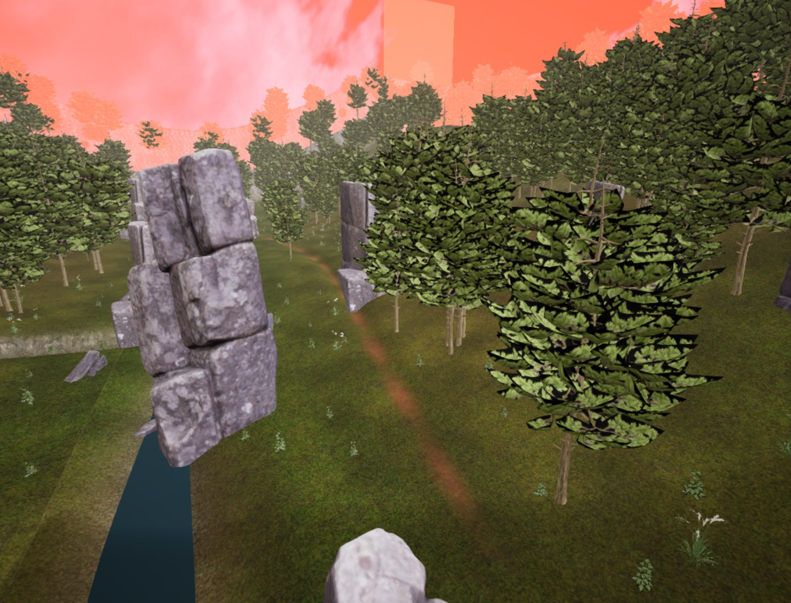
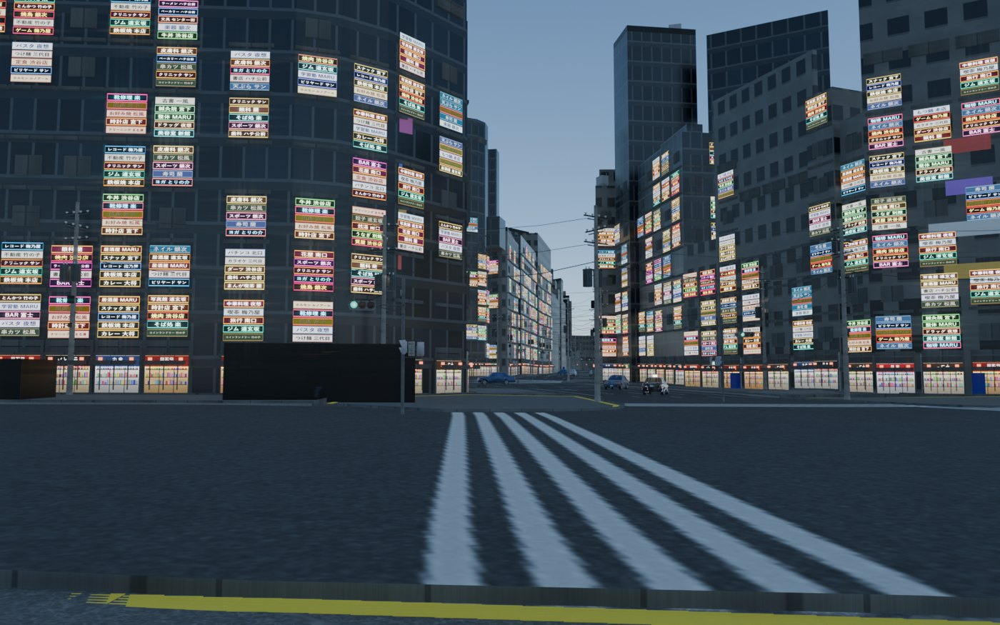
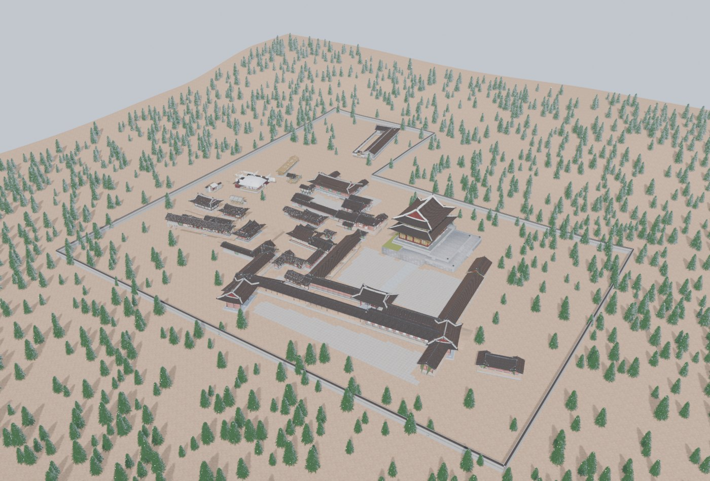
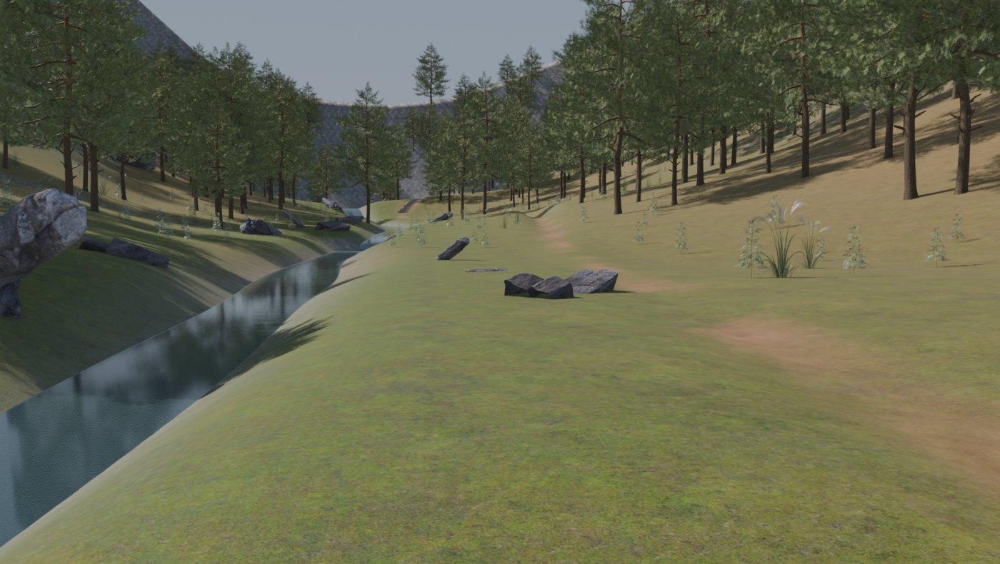
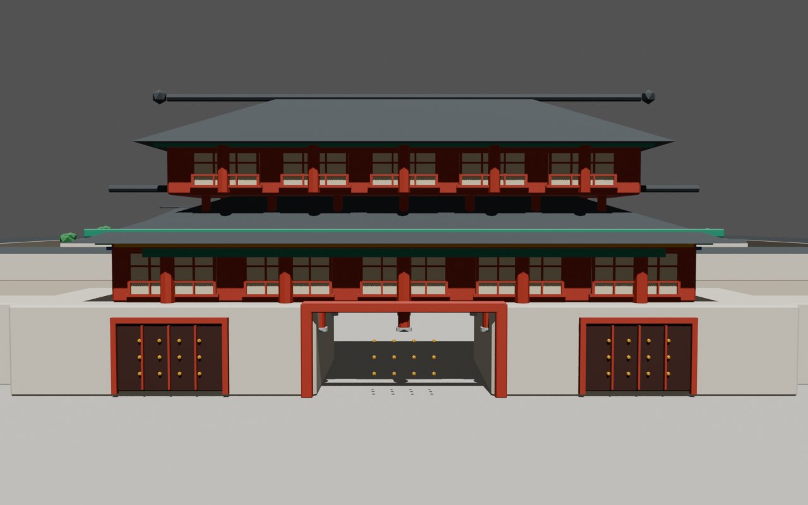
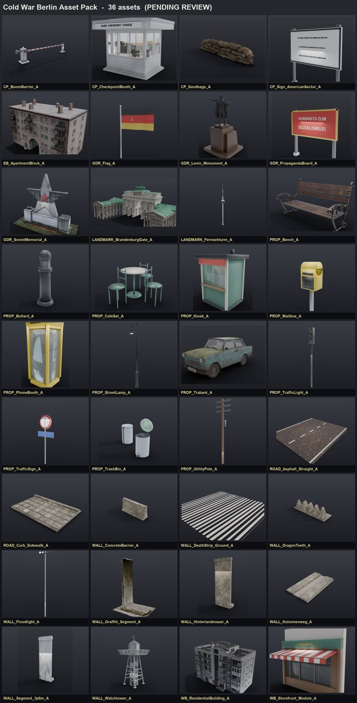

# ShootTheMoon

**OVERDARE**(Unreal 기반 Roblox 계열 UGC 플랫폼) 위에서 게임을 만들고,
그 맵을 Blender에서 실제 지리·유산 데이터로 짓는다.

관통하는 원칙 하나 — **맵은 손으로 배치하지 않는다.** 실측 도면, 국가유산청 3D 스캔,
PLATEAU 도시 데이터, OSM을 좌표계째로 가져와 배치가 데이터에서 나오게 만든다.
(냉전 베를린 맵을 손배치로 11번 갈아엎고 얻은 결론이다.)

| 리포 | 내용 |
|---|---|
| **[onlyoneshot](https://github.com/ShootTheMoon/onlyoneshot)** | ONLY ONE SHOT — 근접전 FPS. Luau 41종, 라이브 맵 3,396 인스턴스 |
| **[overdare-map-pipeline](https://github.com/ShootTheMoon/overdare-map-pipeline)** | Blender → OVERDARE 변환·배치 툴킷. 30k tri / 텍스처 1장 / Y-up cm 규칙과 검증된 함정 |
| **[heritage-maps](https://github.com/ShootTheMoon/heritage-maps)** | 국가유산청 스캔 기반 한국 맵 (산곡·경복궁·창덕궁·소쇄원) |
| **[coldwar-berlin-assetpack](https://github.com/ShootTheMoon/coldwar-berlin-assetpack)** | 냉전 베를린 에셋 팩 36종 |
| **[shibuya-assetpack](https://github.com/ShootTheMoon/shibuya-assetpack)** | 시부야 — PLATEAU LOD2 + OSM |

---

### ONLY ONE SHOT — 인게임

조선 산곡 맵. 260 × 260 m, MeshPart 1,725 + Part 1,669.

---

### 맵

| | |
|---|---|
|  **시부야** — PLATEAU LOD2 + OSM. EPSG:6677 좌표를 그대로 임포트해서 건물·도로 배치가 구조적으로 정확하다 |  **창덕궁** — 국가유산청 공식 스캔 17건, 25.4 M 트라이앵글 / 508 머티리얼을 실측 후 재질별 감축 |
|  **조선 산곡** — 해석적 높이함수로 지형을 저작하고 스캔 식생을 드레싱으로 얹었다. 현재 유일한 라이브 맵 |  **경복궁** — 광화문·근정전·경회루. 임포트 완료 후 성능 사유로 대기 중 |

**냉전 베를린 에셋 팩** — 36종. 장벽·감시탑·체크포인트·트라반트·프로파간다 보드.

---

### 배운 것들

- **성능이 먼저 무너진다.** 수원 화성을 `ServerStorage`로 옮긴 변경 하나로 로비가 28 → 44 fps가 됐다.
  모바일 타깃에서 유산 스캔 밀도는 그대로 못 쓴다.
- **FBX 파일 크기는 폴리곤 수의 지표가 아니다.** 대부분이 임베드 텍스처다.
- **임포트는 발행과 배치, 두 단계다.** 발행은 되돌릴 수 없다.
- **텍스처는 건물 사이에서 바이트 동일하게 중복된다.** 창덕궁 1,011 인스턴스 → 고유 304개, 3.3 GB 절약.

원본 스캔·도시 데이터의 출처와 라이선스는 각 에셋 팩 리포의 `ATTRIBUTION.md`에 있다.
